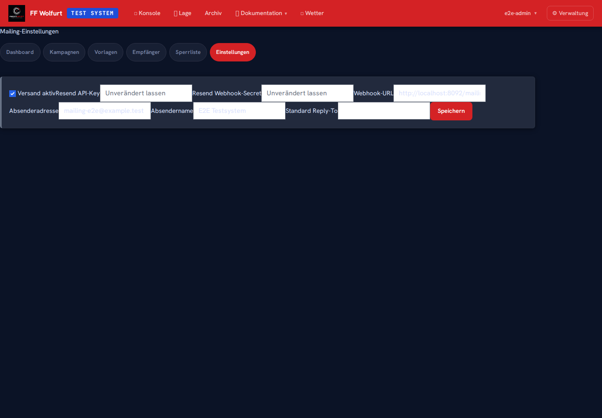
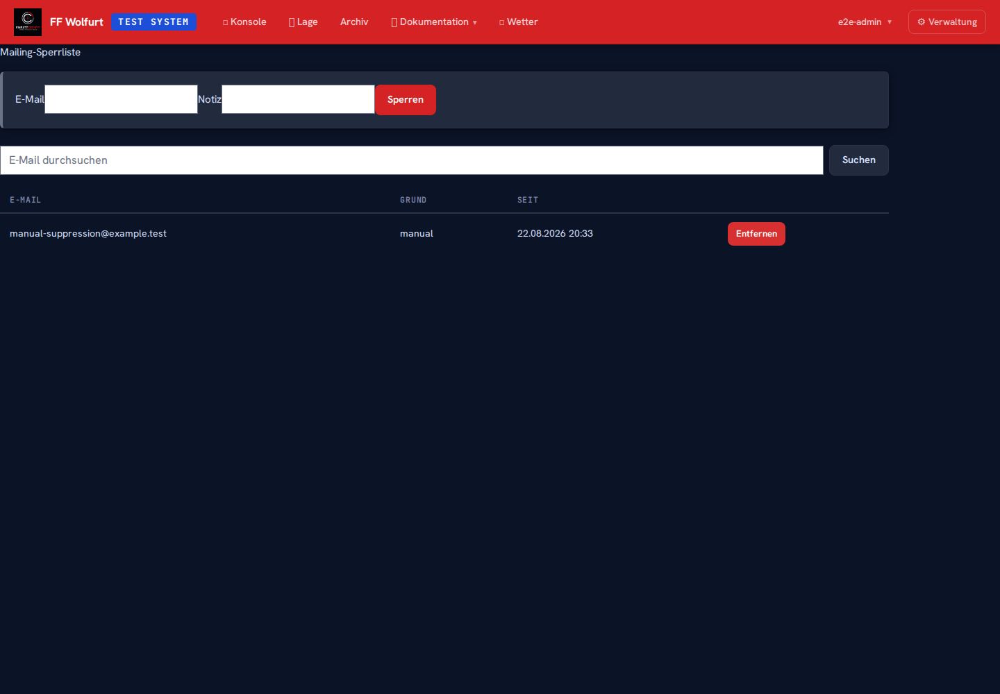

# Mailing-Modul (Administration)

← [Zurück zur Startseite](Home.md)

> URL: `/mailing/`  
> Zugänglich für: `mailing_admin`, `mailing_sender`, `org_admin`, `admin`, `system_admin`  
> Konfiguration und Stammdatenpflege: `mailing_admin`, `org_admin`, `admin`, `system_admin`

Das Mailing-Modul dient zum Erstellen, Planen und Auswerten von Serienmail-Kampagnen
über Resend. Vorlagen, Empfängerlisten, Zustellstatus, Öffnungen, Klicks und
Sperreinträge werden je Organisation getrennt verwaltet.

Das Modul ist ein **eigenständiges Versandsystem**. Es verwendet einen eigenen
Resend-API-Key je Organisation und ist absichtlich vom Versand für Passwort-Reset,
Willkommensmail und andere Transaktionsmails getrennt. Siehe auch
[Mail-Versand (SMTP/Office 365)](Administration-Mail-Versand.md) für den systemweiten
Transaktionsmail-Versand - das Mailing-Modul hier ist davon unabhängig.

---

## Modul aktivieren (zweistufig, wie UAS/Objekt)

Beide Schalter müssen an sein:

1. **Systemweit** (nur `system_admin`): `/admin/settings` → Abschnitt
   **"Systemweite Module"** → **📧 Mailing** → **Systemweit aktivieren**. Setzt den
   SystemSettings-Key `mailing_module_enabled`.
2. **Je Organisation** (Org-Admin): `/admin/settings` → Org-Abschnitt →
   **📧 Mailing** → **Für diese Organisation aktivieren**. Solange das System-Flag
   aus ist, ist die Org-Checkbox nicht wirksam.

Erst wenn beide Schalter aktiv sind, erscheint **📧 Mailing** in der Navigation und
die `/mailing/*`-Routen sind erreichbar. Bei deaktiviertem Modul liefern sie HTTP
404. Das Ausschalten versteckt die Ansichten; vorhandene Vorlagen, Listen,
Kampagnen und Auswertungen werden nicht gelöscht.

Die Versandkonfiguration unter **Mailing → Einstellungen** besitzt zusätzlich den
Schalter **Versand aktiv**. Dieser gibt den tatsächlichen Kampagnenversand erst frei,
ändert aber nicht die Sichtbarkeit des Moduls.

## Rollen und Rechte

| Rolle | Rechte |
|-------|--------|
| `mailing_admin` | Vollzugriff auf Dashboard, Vorlagen, Empfängerlisten, Tags, Kampagnen, Einstellungen, Berichte und Sperrliste |
| `mailing_sender` | Kampagnen aus vorhandenen Vorlagen und Listen erstellen, testen, planen, senden, abbrechen, fehlgeschlagene Zustellungen erneut einreihen und Kampagnendaten als CSV exportieren |
| `org_admin`, `admin`, `system_admin` | Impliziter Vollzugriff wie `mailing_admin`; eine zusätzliche Rollenzuweisung ist nicht erforderlich |

`mailing_sender` kann keine Vorlagen, Listen, Tags, Versandkonfiguration oder
Sperreinträge ändern. Dadurch kann die Organisation redaktionelle Vorbereitung und
operativen Versand voneinander trennen.

## Resend je Organisation konfigurieren

**Mailing → Einstellungen** (URL: `/mailing/settings`)



| Feld | Bedeutung |
|------|-----------|
| Versand aktiv | Gibt den Kampagnenversand für diese Organisation frei |
| Resend API-Key | Dedizierter API-Key des Mailing-Resend-Kontos; wird verschlüsselt gespeichert und nach dem Speichern nicht mehr angezeigt |
| Absenderadresse | Bei Resend verifizierte Adresse, z. B. `newsletter@feuerwehr.example` |
| Antwortadresse | Standardziel für Antworten; kann je Kampagne überschrieben werden |
| Absendername | Sichtbarer Name der Organisation im Posteingang |
| Webhook Signing Secret | Signatur-Secret aus dem Resend-Dashboard; wird verschlüsselt gespeichert |

Für das Mailing-Modul soll ein eigener Resend-Account beziehungsweise mindestens
ein eigener API-Key und eine getrennte Absender-Domain verwendet werden. So wirken
sich Bounces oder Beschwerden aus Serienmail-Kampagnen nicht auf die Reputation des
Transaktionsmail-Versands aus.

Nach dem Speichern ist die Konfiguration vollständig, wenn **Versand aktiv**,
**Resend API-Key** und **Absenderadresse** gesetzt sind.

## Resend-Webhook einrichten

Die Einstellungsseite zeigt eine organisationsspezifische, signierte Webhook-URL:

```text
https://<einsatzcockpit-host>/mailing/webhook/resend/<org-token>
```

1. URL aus **Mailing → Einstellungen** kopieren.
2. Im Resend-Dashboard einen Webhook mit dieser URL anlegen.
3. Mindestens `email.delivered`, `email.bounced` und `email.complained` abonnieren.
4. Das Signing Secret aus Resend in **Webhook Signing Secret** eintragen und
   speichern.

Der Empfänger prüft `svix-id`, `svix-timestamp` und `svix-signature`. Wiederholte
Events mit derselben `svix-id` werden idempotent verarbeitet.

| Event | Wirkung im Einsatzcockpit |
|-------|---------------------------|
| `email.delivered` | Queue-Eintrag erhält den Status **delivered** |
| `email.bounced` (Hard Bounce oder nicht näher klassifiziert) | Queue-Eintrag erhält **bounced**; Adresse wird automatisch mit Grund `hard_bounce` gesperrt |
| `email.bounced` (Soft/Transient/Temporary) | Queue-Eintrag erhält **bounced**; keine automatische Sperre |
| `email.complained` | Adresse wird automatisch mit Grund `complaint` gesperrt |

## Sperrliste verwalten

**Mailing → Sperrliste** (URL: `/mailing/suppression`)



Gesperrte Adressen werden beim Aufbau der Versandwarteschlange ausgeschlossen.
Hard Bounces und Beschwerden tragen das System automatisch ein. Ein
`mailing_admin` kann zusätzlich eine Adresse mit Notiz manuell sperren oder einen
Eintrag wieder entfernen.

Vor dem Entfernen eines automatisch erzeugten Eintrags muss geklärt sein, dass die
Adresse wieder zustellbar ist beziehungsweise der Empfänger erneut zugestimmt hat.

## SMTP-Fallback

Kann Resend eine Nachricht nicht senden, versucht das Mailing-Modul als zweite
Stufe die bereits vorhandene SMTP-Konfiguration der Organisation:

```text
Mailing-Resend → OrgSmtpConfig → Fehler protokollieren und Retry/Fehlstatus
```

Der Fallback verwendet `OrgSmtpConfig`; es gibt dafür keine zweite SMTP-Maske im
Mailing-Modul. Einrichtung und Test des Organisations-SMTP-Servers sind unter
[Mail-Versand (SMTP/Office 365)](Administration-Mail-Versand.md) beschrieben.
Microsoft Graph aus der Transaktionsmail-Fallback-Kette wird vom Mailing-Modul nicht
als eigener Versandweg verwendet.

## Empfänger per API importieren

Eine bestehende **statische** Empfängerliste kann über die REST-API ergänzt werden:

```text
POST /api/v1/mailing/recipient-lists/{id}/import
X-API-Key: <api-key>
Content-Type: application/json
```

```json
{
  "Key": "sybos-export-2026-08-22",
  "recipients": [
    {
      "email": "max.mustermann@example.at",
      "display_name": "Max Mustermann"
    }
  ]
}
```

Der API-Key muss zur selben Organisation wie die Liste gehören. `Key` ist der
Idempotenzschlüssel: derselbe Wert für dieselbe Liste wird nur einmal importiert.
Die Antwort enthält `added`, `skipped`, `total_submitted` und `idempotent_hit`.
Ungültige oder bereits vorhandene E-Mail-Adressen werden übersprungen. Pro Aufruf
sind höchstens 5.000 Empfänger zulässig.

## Export und Berichte

| Funktion | Route | Inhalt / Berechtigung |
|----------|-------|-----------------------|
| Empfängerliste als CSV | `/mailing/lists/{id}/export.csv` | Aufgelöste Adressen und Anzeigenamen; `mailing_admin` |
| Kampagnenstatus als CSV | `/mailing/campaigns/{id}/export.csv` | Queue- und Trackingdaten je Empfänger; `mailing_admin` oder `mailing_sender` |
| Dashboard-Bericht | `/mailing/dashboard/report` | Druckansicht der organisationsweiten Kennzahlen; `mailing_admin` |
| Dashboard-Bericht als PDF | `/mailing/dashboard/report.pdf` | PDF-Auswertung; `mailing_admin` |

CSV-Dateien können personenbezogene Daten und Zustellinformationen enthalten. Sie
sind entsprechend den Datenschutz- und Aufbewahrungsregeln der Organisation zu
behandeln.

---

**Verwandt:** [Mailing-Kampagnen verwenden](Anwender-Mailing-Kampagnen.md) ·
[Mail-Versand (SMTP/Office 365)](Administration-Mail-Versand.md) ·
[API-Keys verwalten](Administration-API-Keys-verwalten.md)
