# Kanban-Board bedienen

← [Zurück zur Startseite](Home)

## Aufbau des Boards

Das Board besteht aus **fixen Spalten** (immer vorhanden) und optionalen **Abschnittsspalten**.
Sekundäre Funktionen (Umbenennen, Verschieben ohne Drag & Drop, Kommandant zuweisen, …) stecken
in kompakten Chips und **⋯**-Menüs statt in dauerhaft sichtbaren Bedienelementen.

### Fixe Spalten

| Spalte | Bedeutung |
|--------|-----------|
| **Alarmiert** | Fahrzeuge, die alarmiert wurden aber noch nicht am Einsatzort |
| **Aktiv** | Fahrzeuge im Einsatz |
| **Aufträge** | Aufgaben ohne zugewiesenes Fahrzeug |
| **Meldungen** | Zeitgesteuerte Meldungen (5-Min, 10-Min, eigene) |
| **Nachbarwehren** | Fahrzeuge von Nachbardepartements |
| **Gerettete Personen** | Erfasste Personen |

### Abschnittsspalten

Für größere Einsätze können eigene Abschnitte angelegt werden:
Kopfzeile → **+ Abschnitt** → Name eingeben.

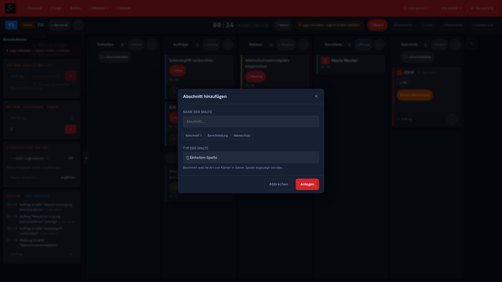

## Spalten verwalten

Jede Spalte hat rechts oben ein **⋯**-Menü ("Spaltenaktionen") zum Umbenennen. Abschnittsspalten
(nicht die fixen Spalten) lassen sich darüber auch löschen.

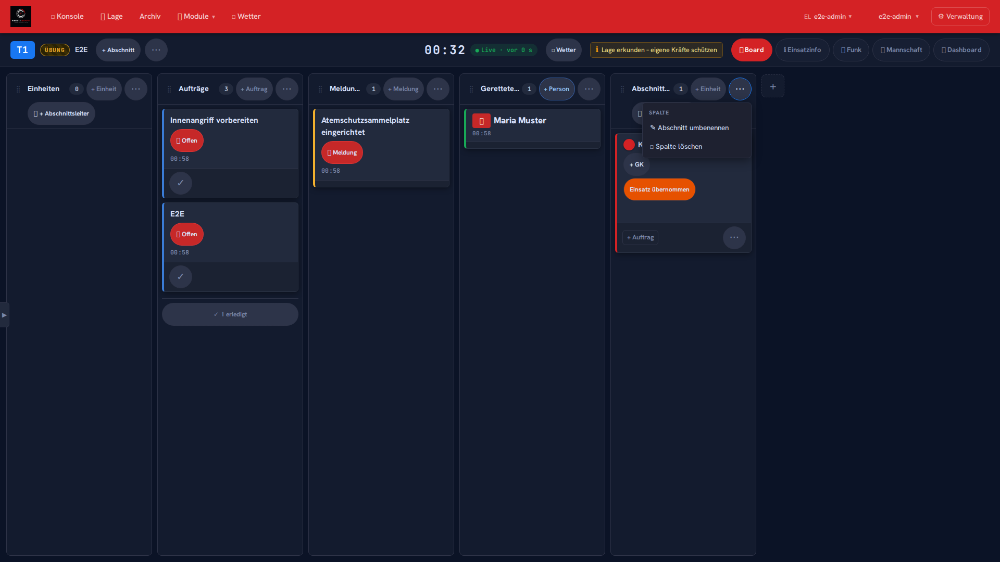

Bei Fahrzeug- und Nachbarwehren-Spalten kommt zusätzlich ein Abschnittsleiter-Chip dazu
(**+ Abschnittsleiter** bzw. **👤 AL: Name**). Klick öffnet eine Auswahl aus dem
Mannschaftsregister oder eine Freitext-Eingabe.

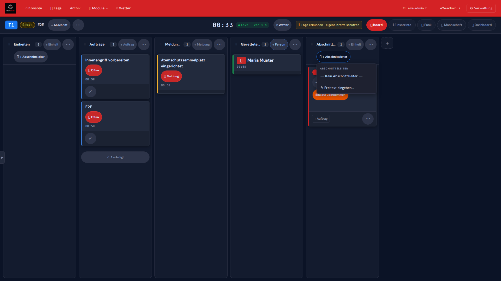

## Fahrzeuge verschieben

**Drag & Drop:** Fahrzeug-Karte anfassen und in eine andere Spalte ziehen. Die Änderung wird
sofort auf alle verbundenen Geräte übertragen. Auf Touch-Geräten: Karte lange drücken →
verschieben.

**Ohne Drag & Drop:** Karte → **⋯ Fahrzeugaktionen** → **Verschieben nach** → Zielspalte
auswählen. Gleichwertige Alternative, z. B. praktisch bei vielen Spalten oder wenn Ziehen gerade
unpraktisch ist (Touch-Gerät in einer Hand, viele Spalten außerhalb des Bildschirms, …).

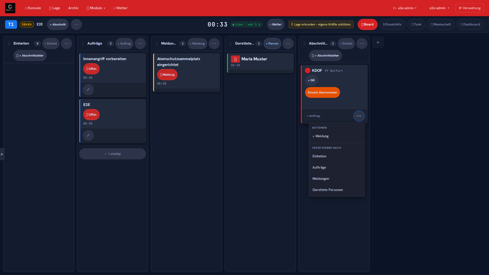

## Fahrzeug-Karte

- **GK-Chip** (**+ GK** bzw. **GK: Name**): öffnet die Detailansicht zum Zuweisen eines
  Gruppenkommandanten aus dem Mannschaftsregister.
- **Einheitenstatus-Chip** (z. B. "Einsatz übernommen"): öffnet ein Menü mit allen verfügbaren
  Status.
- **⋯ Fahrzeugaktionen**: **+ Meldung** für dieses Fahrzeug anlegen, **Verschieben nach**
  (siehe oben).
- **+ Auftrag** bleibt direkt auf der Karte für schnelles Anlegen ohne Umweg über die Sidebar.

## Aufträge anlegen

Einsatzdetails-Sidebar → **Auftrag hinzufügen** (oder `Strg + A`), oder direkt im Spalten-Header
der Spalte **Aufträge** über **+ Auftrag**.

- **Titel**: Kurze Aufgabenbeschreibung
- **Detail**: Optionaler Freitext
- **Fahrzeug**: Optional einem Fahrzeug zuweisen

Oder direkt in einer Fahrzeug-Karte: **+ Auftrag**.

## Aufträge abhaken

Der **✓**-Button direkt auf der Auftragskarte ("Auftrag als erledigt markieren") markiert den
Auftrag als erledigt, ohne die Karte extra zu öffnen.

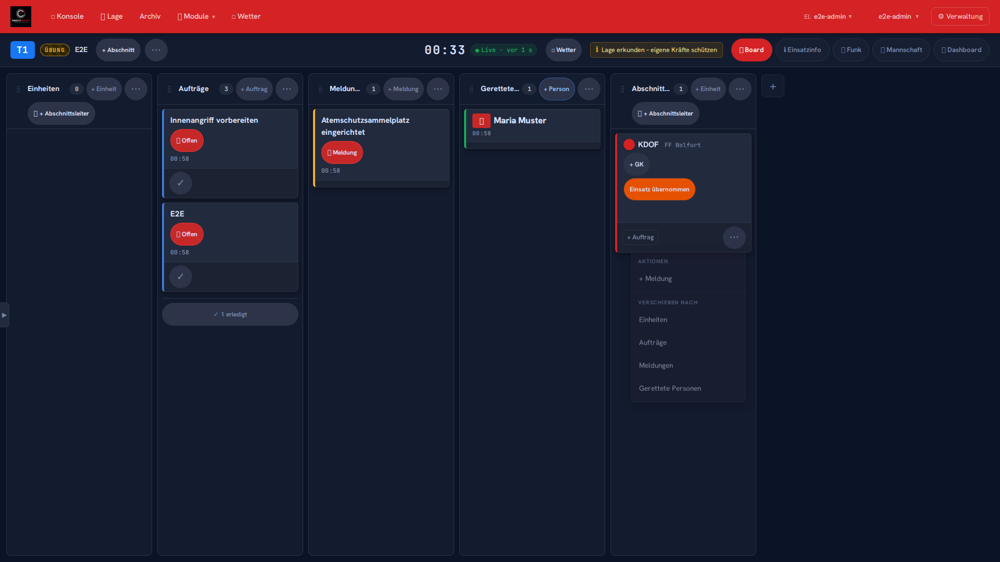

## Erledigt-Gruppe einklappen

Erledigte und stornierte Karten sammeln sich am Ende jeder Spalte in einer Gruppe
("**N erledigt**"), die sich per Klick ein- und ausklappen lässt. Der Zustand (auf/zu) bleibt je
Spalte und Gerät erhalten, auch wenn andere Nutzer:innen zwischenzeitlich neue Karten hinzufügen
oder Karten dieser Spalte erledigen.

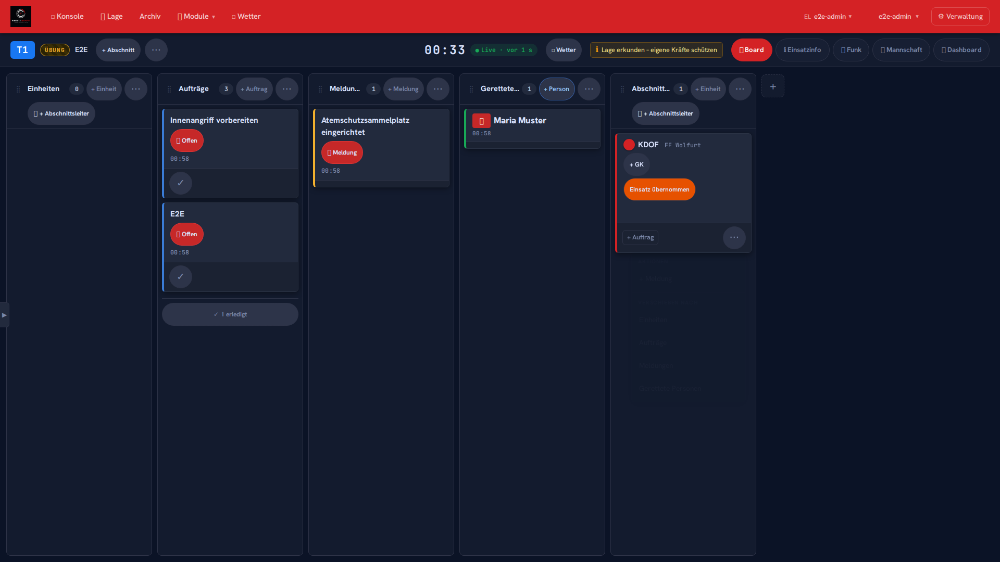
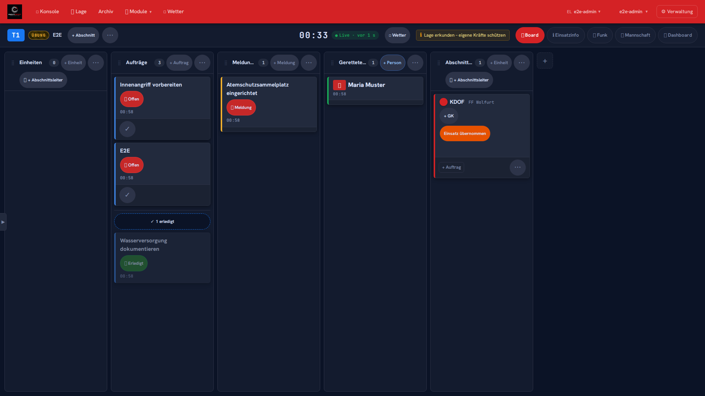

## Meldungen

Zeitgesteuerte Meldungen erscheinen als Pop-up, wenn die Zeit abgelaufen ist. Sie können:
- **Erledigt** markiert werden (Pop-up verschwindet)
- **Verschoben** werden (neue Zeit eingeben)
- **Storniert** werden

Neue Meldung: Einsatzdetails-Sidebar → **Meldung hinzufügen** (oder `Strg + M`), oder direkt in
der Spalte **Meldungen** über **+ Meldung**.

## Einsatzdetails (Sidebar)

Der Pfeil am linken Bildschirmrand blendet die **Einsatzdetails**-Seitenleiste ein oder aus:
Lage-Ticker, Auftrag/Meldung hinzufügen (mit den Tastenkürzeln `Strg+A`/`Strg+M`), Einsatzleiter
vor Ort zuweisen und der vollständige Verlauf. Auf Mobilgeräten ist die Sidebar ausgeblendet.

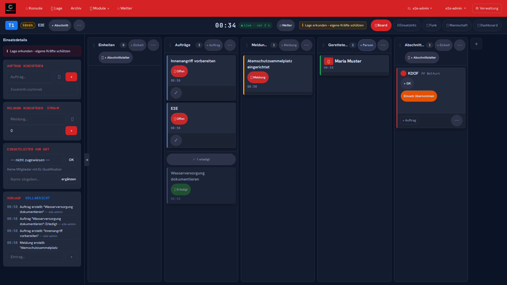

## Weitere Aktionen (Header-Menü)

Rechts oben in der Kopfzeile bündelt **⋯ Weitere Aktionen** seltener gebrauchte Funktionen: KI,
Drohne/UAS, QR-Code anzeigen, PDF-Export, Drucken sowie (im Gefahrenbereich) Einsatz abschließen.

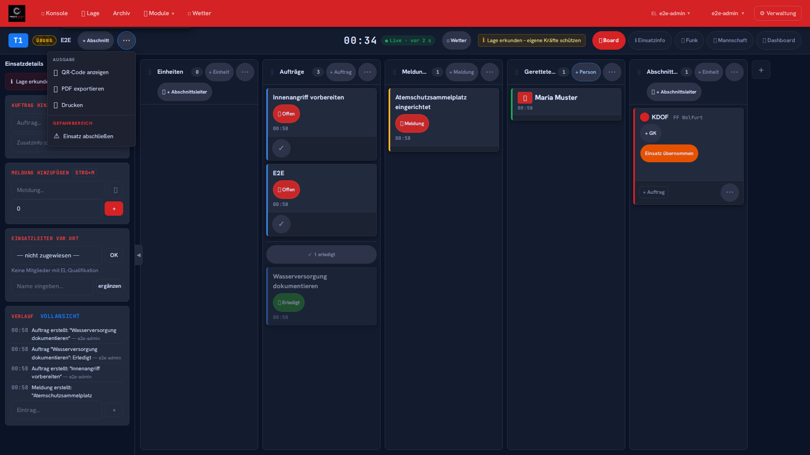

## Mobile & Tablet

**Mobil (≤760px):** Eine Dropdown-Auswahl ersetzt das Spaltenraster — jeweils eine Spalte ist
aktiv sichtbar, per Auswahl oder Tab-Leiste wechselbar. Die Einsatzdetails-Sidebar ist
ausgeblendet, **+ Abschnitt** und **⋯ Weitere Aktionen** bleiben oben in der Kopfzeile erreichbar.

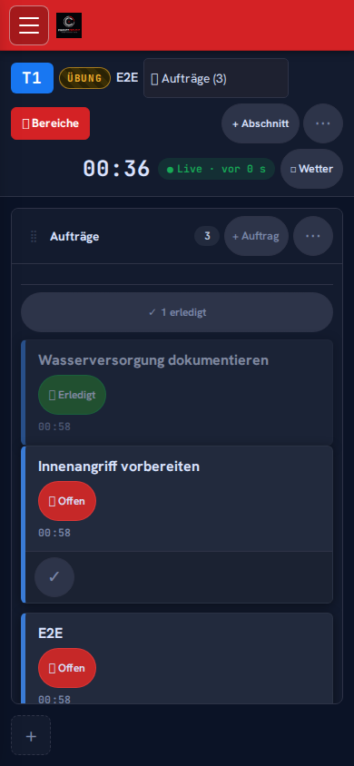
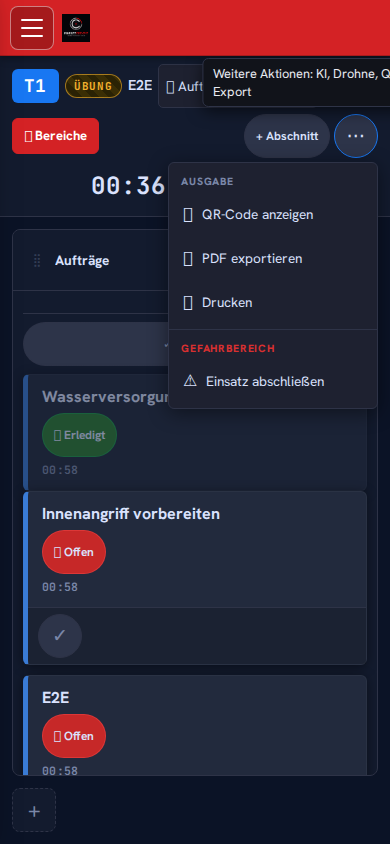

**Tablet (bis ca. 1024px):** Das klassische Spaltenraster bleibt erhalten, die
Einsatzdetails-Sidebar lässt sich weiterhin ein- und ausblenden.

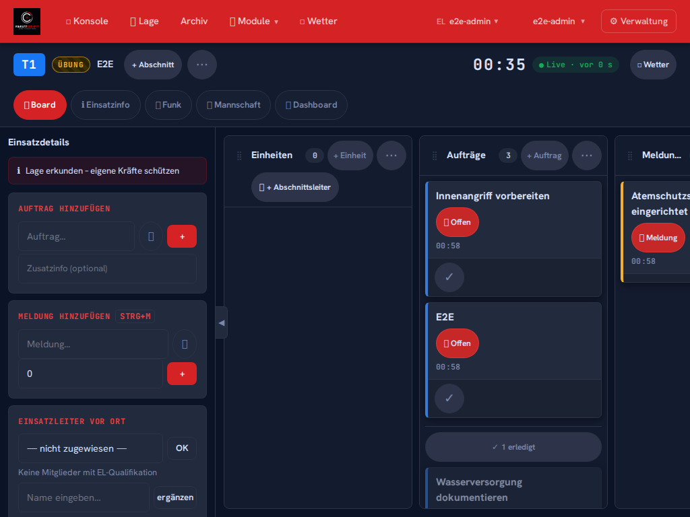

## Lage-Ticker

Am unteren Rand der Sidebar rotieren **Lage-Hinweise** — kurze Erinnerungen an wichtige Maßnahmen
je nach Stichwort.

## Timer

In der Kopfzeile läuft ein **Einsatz-Timer** seit dem Alarmdatum. Bei 5 und 10 Minuten erscheint
ein Pop-up.
