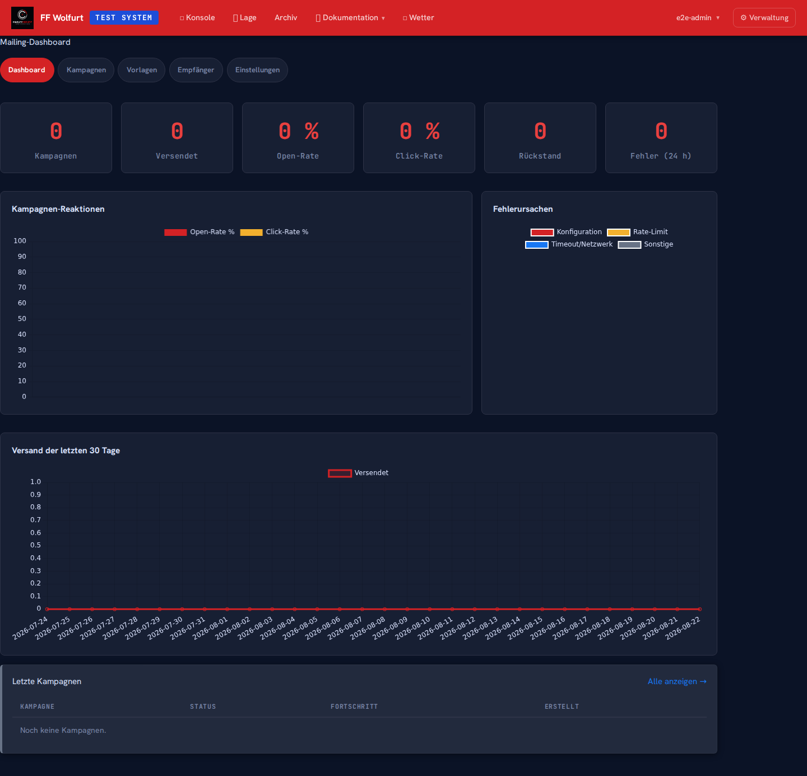
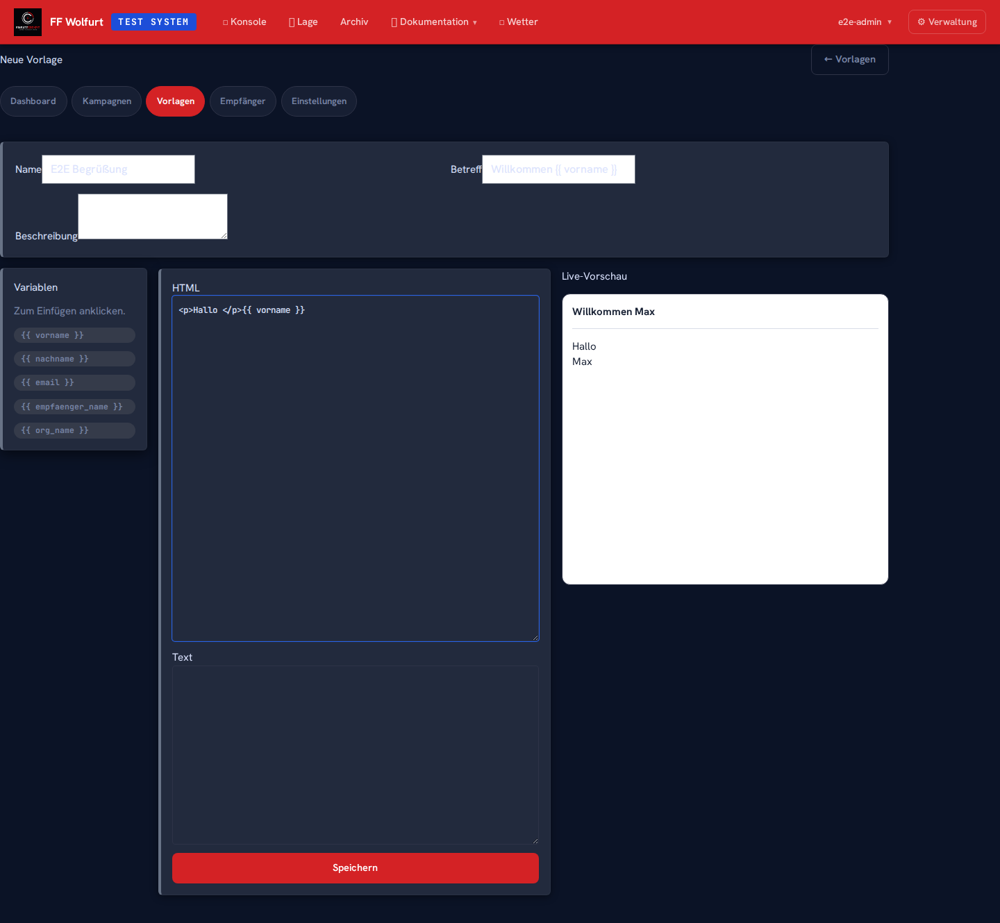
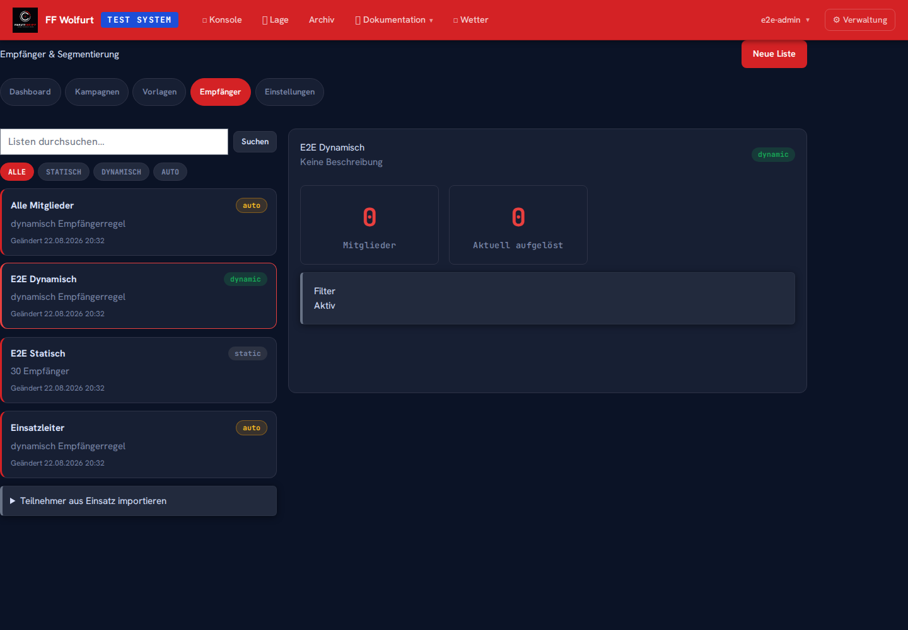
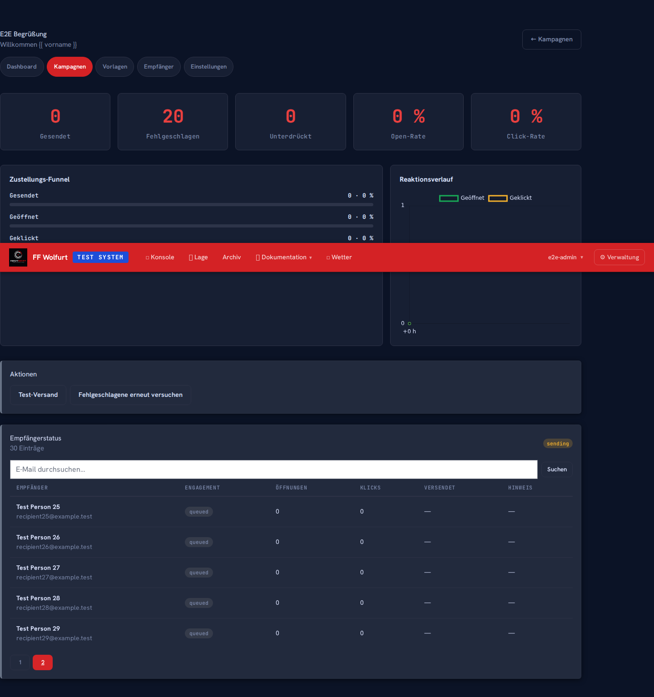

# Mailing-Kampagnen

← [Zurück zur Startseite](Home)

> URL: `/mailing/`  
> Zugänglich für: `mailing_sender`, `mailing_admin`, `org_admin`, `admin`, `system_admin`  
> Modul muss vom System-Admin und Org-Admin aktiviert sein (siehe [Administration Mailing-Modul](Administration-Mailing-Modul))

Das Mailing-Modul bündelt Vorlagen, Empfängerlisten und Versandstatus für
organisationsbezogene Serienmail-Kampagnen. Ein `mailing_sender` erstellt und
versendet Kampagnen aus vorbereiteten Vorlagen und Listen. Ein `mailing_admin`
pflegt zusätzlich diese Grundlagen sowie Tags, Dashboard und Sperrliste.

---

## Dashboard

**Mailing → Dashboard** (URL: `/mailing/dashboard`, nur `mailing_admin`)



Die Kennzahlen zeigen Kampagnen, gesendete Nachrichten, Öffnungs- und Klickrate,
offene Warteschlange sowie Fehler der letzten 24 Stunden. Drei Diagramme stellen
Öffnungs-/Klickraten je Kampagne, Versand der letzten 30 Tage und Fehlerkategorien
dar. Unter **Bericht** beziehungsweise **PDF** lässt sich die Auswertung exportieren.

## Vorlage erstellen

**Mailing → Vorlagen → Neue Vorlage** (URL: `/mailing/templates/new`, nur
`mailing_admin`)



1. Einen eindeutigen **Namen** und optional eine Beschreibung eingeben.
2. **Betreff**, HTML-Inhalt und optionalen Textinhalt erfassen.
3. Eine Variable anklicken, um sie an der Cursorposition einzufügen.
4. Die automatisch aktualisierte **Live-Vorschau** prüfen.
5. **Speichern**.

| Variable | Inhalt |
|----------|--------|
| `{{ vorname }}` | Vorname des Empfängers |
| `{{ nachname }}` | Nachname des Empfängers |
| `{{ email }}` | E-Mail-Adresse |
| `{{ empfaenger_name }}` | Vollständiger Anzeigename |
| `{{ org_name }}` | Name der eigenen Organisation |

Die Vorschau verwendet Beispieldaten. Fehlt beim tatsächlichen Empfänger ein Wert,
sollte der Text trotzdem verständlich bleiben. Betreff, HTML und Textversion vor
dem ersten Versand mit **Test-Versand** prüfen.

## Empfängerlisten aufbauen

**Mailing → Empfänger** (URL: `/mailing/lists`, nur `mailing_admin`)



Links werden die Listen gesucht und nach Typ gefiltert, rechts erscheinen Details,
Empfängerzahl, Filterzusammenfassung und Aktionen der gewählten Liste.

### Statische Liste per CSV

1. **Neue Liste** → Typ **Statisch** → Name und Beschreibung → **Speichern**.
2. Liste öffnen und eine CSV-Datei hochladen.
3. Ergebnis im Detailbereich prüfen und bei Bedarf als CSV exportieren.

Unterstützte Spalten sind `email` oder `e-mail` sowie `display_name`, `name` oder
die Kombination `vorname` + `nachname`. Komma und Semikolon werden erkannt.
Ungültige und innerhalb der Liste bereits vorhandene Adressen werden übersprungen.

### Dynamische Liste

Bei einer dynamischen Liste werden Mitglieder beim Einreihen der Kampagne aus dem
aktuellen Mannschaftsregister aufgelöst. Verfügbare Filter:

- aktive oder inaktive Mitglieder,
- eine oder mehrere Qualifikationen,
- ein oder mehrere Tags,
- Mitglied seit: Von-/Bis-Datum.

Die Detailansicht zeigt die Filter als lesbare Zusammenfassung und die aktuell
aufgelöste Empfängerzahl. Änderungen am Mannschaftsregister wirken damit auf einen
späteren Versand, ohne die Liste neu zu importieren.

### Automatische Listen

Das System stellt zwei nicht manuell zu pflegende Listen bereit:

| Liste | Auflösung |
|-------|-----------|
| **Alle Mitglieder** | Alle Mitglieder der Organisation mit gültiger E-Mail-Adresse |
| **Einsatzleiter** | Mitglieder mit Einsatzleiter-Funktion und gültiger E-Mail-Adresse |

### Einsatzteilnehmer als Snapshot importieren

Im Listenbereich unter **Aus Einsatz importieren**:

1. Einsatz wählen.
2. Namen für die neue Liste eingeben.
3. Import starten.

Das System erzeugt eine statische Momentaufnahme der am Einsatz beteiligten
Personen. Spätere Änderungen am Einsatz verändern diese Liste nicht.

## Tags zur Segmentierung

**Mailing → Tags** (URL: `/mailing/tags`, nur `mailing_admin`)

Tags bilden organisationsspezifische Zielgruppen wie `Jugend`, `Atemschutz` oder
`Ausschuss` ab. Zuerst Name und optional Farbe anlegen, danach den Mitgliedern im
Tag-Bereich zuweisen. Dynamische Empfängerlisten können einen oder mehrere Tags als
Filter verwenden.

Tags ergänzen Qualifikationen; sie ersetzen keine fachliche Qualifikation im
Mannschaftsregister.

## Kampagne erstellen

**Mailing → Kampagnen → Neue Kampagne** (URL: `/mailing/campaigns/new`)

1. Vorbereitete **Vorlage** wählen.
2. Eine oder mehrere **Empfängerlisten** markieren.
3. Optional einen Einsatz als Quelle, einen abweichenden Betreff, eine
   Antwortadresse und die Öffnungs-/Klickmessung festlegen.
4. **Kampagne anlegen**. Sie wird zunächst als **Entwurf** gespeichert.
5. In der Detailansicht Anhänge hochladen und die Kampagne kontrollieren.
6. **Test-Versand** sendet eine mit `[TEST]` markierte Nachricht an die eigene
   Benutzeradresse.

Empfänger aus mehreren Listen werden anhand der normalisierten E-Mail-Adresse
automatisch dedupliziert. Gesperrte Adressen werden nicht in die Versandwarteschlange
übernommen.

### Versand-Workflow

```text
Entwurf → Einreihen / Sofort senden → Warteschlange → Versand → Gesendet oder Fehlgeschlagen
       ↘ Planen → Geplant → Warteschlange
       ↘ Abbrechen → Abgebrochen
```

| Aktion | Bedeutung |
|--------|-----------|
| Einreihen | Empfänger auflösen und Queue-Einträge mit Status **queued** erzeugen |
| Sofort senden | Einreihen und den Versandlauf unmittelbar anstoßen |
| Planen | Entwurf zu einem Datum und einer Uhrzeit in der Zeitzone der Organisation einreihen |
| Abbrechen | Nur für Entwürfe und geplante Kampagnen möglich |
| Fehlgeschlagene wiederholen | Fehlgeschlagene Queue-Einträge zurück auf **queued** setzen und Versuchszähler neu starten |

Eine bereits eingereihte Kampagne kann nicht mehr als Entwurf bearbeitet oder
abgebrochen werden. Vorher Empfängerzahl, Betreff, Antwortadresse, Tracking und
Anhänge sorgfältig kontrollieren.

## Queue-Status und Tracking lesen



Die Kampagnen-Detailseite aktualisiert die Versandwarteschlange automatisch. Das
Suchfeld filtert nach E-Mail-Adresse; bei größeren Kampagnen wird die Tabelle über
mehrere Seiten aufgeteilt.

| Status / Kennzahl | Bedeutung |
|-------------------|-----------|
| `queued` | Nachricht wartet auf einen Versandversuch |
| `sending` | Versand wird gerade verarbeitet |
| `sent` | Versanddienst hat die Nachricht angenommen |
| `delivered` | Resend hat die Zustellung per Webhook bestätigt |
| `bounced` | Empfängeradresse hat die Nachricht zurückgewiesen |
| `suppressed` | Adresse stand vor dem Versand auf der Sperrliste und wurde nicht angeschrieben |
| `failed` | Alle aktuellen Versandversuche sind fehlgeschlagen; Fehlermeldung prüfen |
| Öffnungen | Zählpixel wurde geladen, sofern Öffnungsmessung aktiv ist |
| Klicks | Ein getrackter Link wurde aufgerufen, sofern Klickmessung aktiv ist |

Öffnungsraten sind wegen Bildblockern und Datenschutzfunktionen von Mailprogrammen
nur ein Richtwert. Ein Klick ist in der Regel das aussagekräftigere Signal.

Über **CSV exportieren** lassen sich Zustell- und Trackingdaten je Empfänger
auswerten. Fehlgeschlagene Einträge können nach Behebung der Ursache mit
**Fehlgeschlagene wiederholen** erneut eingereiht werden.

---

**Verwandt:** [Mailing-Modul administrieren](Administration-Mailing-Modul) ·
[Mannschaftsregister](Anwender-Mannschaftsregister)
